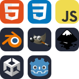

My name is **Ethan Marks**. I'm a 14-year-old student and software engineer.

## Skills

- 🐍 My preferred language is **Python**, and I code most
  of [my projects](https://github.com/ColourlessSpearmint?tab=repositories) in it.
- 🎮 I have a fair bit of experience in **Game Development**; I published
  my [first game on itch.io](https://colourlessspearmint.itch.io/soaring-squirrel-shipment) when I was 11 years old.
- 🖥️ I've done some **Front-End** coding for a secret personal project involving a 🔑 **custom encryption protocol**.
- 🖌️ I taught myself **3D Modeling** in Blender in order to make assets for my 3D printer.

| Lots of Experience                                      | Moderate Experience                                                                                | Currently Learning                                    |
|---------------------------------------------------------|----------------------------------------------------------------------------------------------------|-------------------------------------------------------|
|  |  |  |

## About Me

- 🏫 I'm a [dual-enrolled](https://en.wikipedia.org/wiki/Dual_enrollment) **high-school student** taking courses at my
  local college.
- 💼 I run a **side-business** where I buy old laptops in bulk at auction, purchase and install new parts, flash new
  operating systems, and resell them for profit.
- 📖 My **favorite novels**
  are [Dune](https://www.goodreads.com/book/show/44767458-dune), [The Golden Compass](https://www.goodreads.com/book/show/119322.The_Golden_Compass),
  and [The Fifth Science](https://www.goodreads.com/book/show/41580260-the-fifth-science).
- 🐦‍⬛ My **favorite bird** is the [Starling](https://en.wikipedia.org/wiki/Starling). They have
  colourful [iridescent feathers](https://i.pinimg.com/736x/d2/71/13/d27113be2e9681ff36cbbb1c793acc6f.jpg), they are
  capable of [mimicking human speech](https://www.youtube.com/watch?v=2SSJ7PZ3I6c), and they travel in groups (called
  murmations) [hundreds of thousands of birds strong](https://www.youtube.com/watch?v=V4f_1_r80RY).

## What I'm Working On

- 🌈 **Mantis**: My current active project is [Mantis](https://github.com/ColourlessSpearmint/Mantis), a **digital
  emulator** of a [card game](https://www.explodingkittens.com/products/mantis) of the same name. So far, developing
  this project has taught me a lot about [OOP](https://en.wikipedia.org/wiki/Object-oriented_programming). I plan to use
  **PyTorch** to train a neural network to play the game optimally.
- ☕ **Kotlin**: I'm currently learning **Kotlin**. My motivation is that I want to **expand my skillset** beyond Python
  to another [GPL](https://en.wikipedia.org/wiki/General-purpose_programming_language), and Kotlin seemed like a good
  choice.

## My Setup

| OS                                            | Editors                                                     | Other                                                       |
|-----------------------------------------------|-------------------------------------------------------------|-------------------------------------------------------------|
|  |  |  |

<i>"It took almost 14 billion years for the universe to create you, and it will never do it again."</i>

