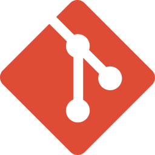
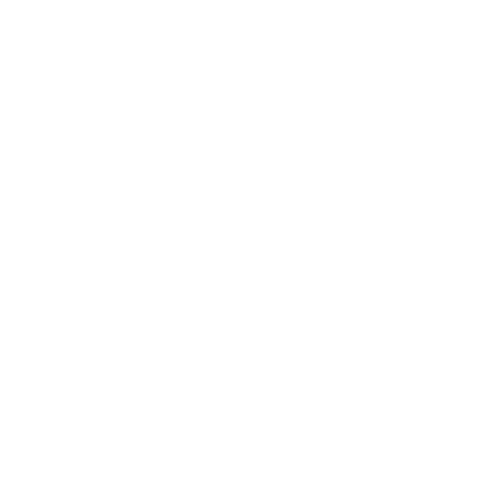
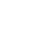
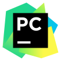
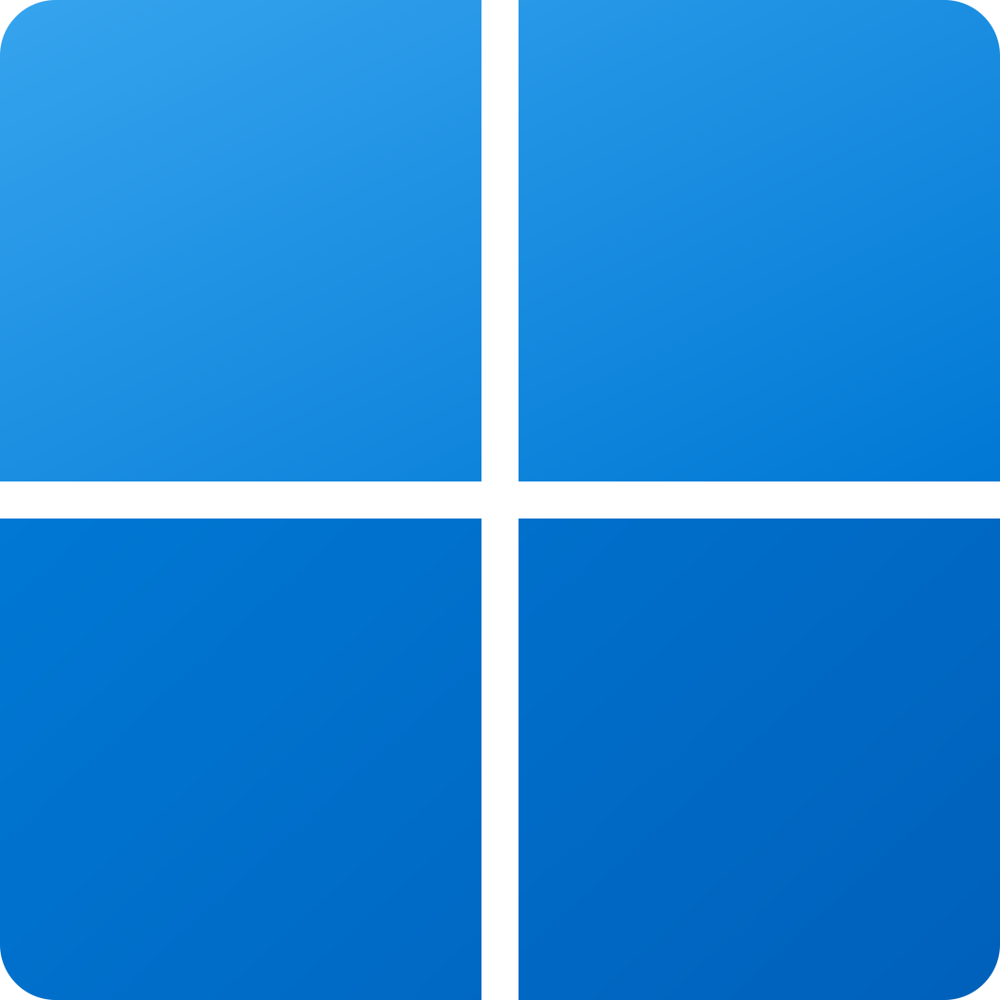
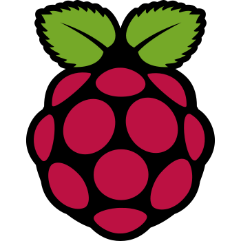

My name is **Ethan Marks**. I'm a 14-year-old student and software engineer.

- 👨‍💻 **Programming**: I have many years of experience coding in Python.
- 🎮 **Game Development**: I developed and published [Soaring Squirrel Shipment](https://ethmarks.itch.io/soaring-squirrel-shipment), a game about flying squirrels.
- 🖥️ **Web Development**: I designed, built, and published my [personal website](https://ethmarks.github.io) from scratch using [Hugo](https://gohugo.io/), [Sass](https://sass-lang.com/), and [GitHub Pages](https://docs.github.com/en/pages)
- 🧊 **3D Modeling**: I've used Blender [Geometry Nodes](https://docs.blender.org/manual/en/latest/modeling/geometry_nodes/introduction.html) to create procedural 3D assets.
- 🏫 **Education**: I'm a homeschooled high school student currently in my third semester of [dual-enrollment](https://en.wikipedia.org/wiki/Dual_enrollment) at my local community college.
- 💼 **Personal Business**: I buy old laptops in bulk at auction, purchase and install new parts, flash new operating systems, and resell them for profit.
- 🖋️ **Blog**: I write about things that interest me in the [posts](https://ethmarks.github.io/posts/) section of my personal website.

## Languages

## Software

## Editors

## Tools

## Operating Systems

