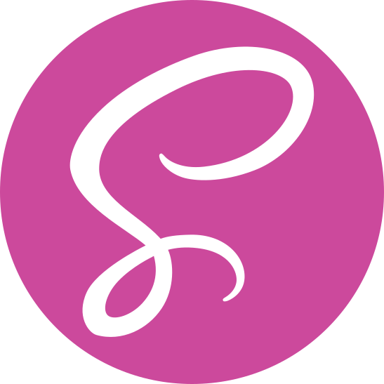
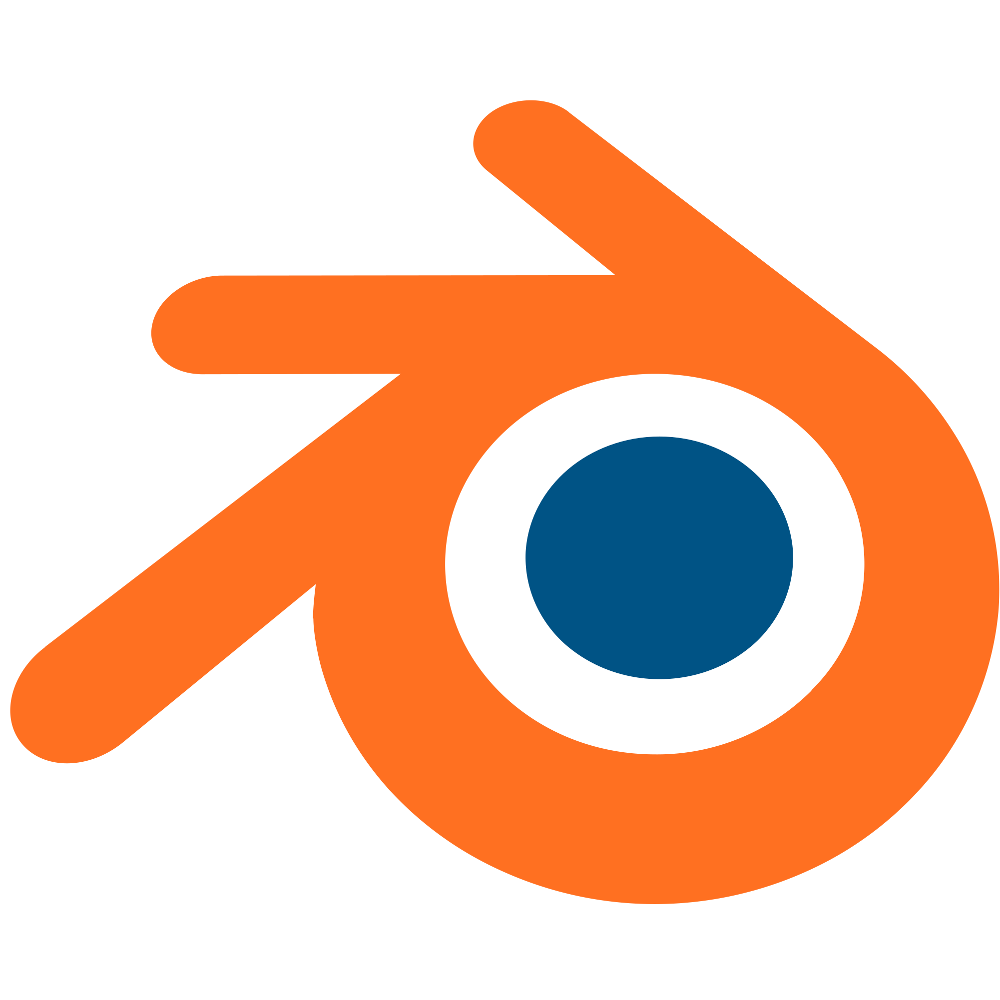

## 👋 Ahoy! I’m Ethan Marks

### 🌟 About Me
- 🧑‍💻 I'm an software developer
- 🎂 I'm 15 years old
- 🎓 I'm a homeschooled high school student in my third semester of dual-enrollment at my local community college
- 🖋️ I write about my projects and things that interest me on [my personal website](https://ethmarks.github.io/posts)

### 🧰 Skills
- 🐍 I have several years of experience coding in Python
- 🖥️ I designed, built, and published my [personal website](https://ethmarks.github.io) from scratch using [Hugo](https://gohugo.io/), [Sass](https://sass-lang.com/), and [GitHub Pages](https://docs.github.com/en/pages)
- 🎮 I developed and published [Soaring Squirrel Shipment](https://ethmarks.itch.io/soaring-squirrel-shipment), a game about flying squirrels

### 🚀 Featured Projects
- 🌍 **[ASCII-Globe](https://ethmarks.github.io/posts/asciiglobe/)** - Text-based cartographic rendering engine
- 📚 **[Thessa](https://ethmarks.github.io/posts/thessa/)** - AI-powered thesaurus application
- 🐿️ **[Soaring Squirrel Shipment](https://ethmarks.itch.io/soaring-squirrel-shipment)** - Itch.io game about flying squirrels

### 🛠️ What I'm Working On

- 🌐 I'm currently working on refactoring the SCSS of my [personal website](https://ethmarks.github.io) to be more DRY, responsive, and aesthetic
- 💼 I'm running a personal business flipping and reselling old laptops that I bought at auction
- 💎 I'm learning Ruby through [The Odin Project](https://www.theodinproject.com/paths/full-stack-ruby-on-rails/courses/ruby)

### ✨ Fun Facts

- 🗺️ I've been to 48 US states and 5 Canadian provinces
- 🦋 My favorite map projection is the [Waterman Butterfly](https://ethmarks.github.io/posts/waterman/)
- ⚡ My favorite logical operator is XOR

### 📫 Contact

- 📧 **Email:** [colourlessspearmint@gmail.com](mailto:colourlessspearmint@gmail.com)
- 🌐 **Website:** [ethmarks.github.io](https://ethmarks.github.io)
- 💻 **CodePen:** [@ethmarks](https://codepen.io/ethmarks)
- 🎮 **Itch.io:** [ethmarks.itch.io](https://ethmarks.itch.io/)

