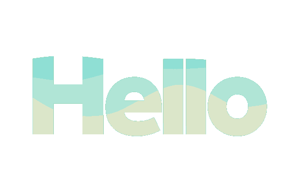
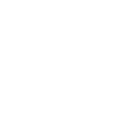

# 👋 Ahoy! I’m Ethan Marks

I’m a 15-year-old **software developer** currently in my third semester of dual-enrollment at my local community college. My work lives at the intersection of code, design, and curiosity.

## 🛠️ Skills & Technologies

I have several years of experience coding in **Python**, and I designed, built, and published my [personal website](https://ethmarks.github.io) from scratch using **Hugo**, **Sass**, and **GitHub Pages**. I also developed and published the video game **[Soaring Squirrel Shipment](https://ethmarks.itch.io/soaring-squirrel-shipment)**.

## 🚀 Featured Projects

| Project | Description |
| :--- | :--- |
| 🌍 **[ASCII-Globe](https://ethmarks.github.io/posts/asciiglobe/)** | Text-based cartographic rendering engine built with Python. |
| 📚 **[Thessa](https://ethmarks.github.io/posts/thessa/)** | AI-powered thesaurus application. |
| 🐿️ **[Soaring Squirrel Shipment](https://ethmarks.itch.io/soaring-squirrel-shipment)** | Game about flying squirrels, developed and published on Itch.io. |

## ✨ Fun Facts

* 🗺️ I've been to **48 US states** and **5 Canadian provinces**.
* 🦋 My favorite map projection is the **[Waterman Butterfly](https://ethmarks.github.io/posts/waterman/)**.
* ⚡ My favorite logical operator is **XOR**.

## 📫 Contact

Feel free to get in touch! **[ethmarks.dev@gmail.com](mailto:ethmarks.dev@gmail.com)**

